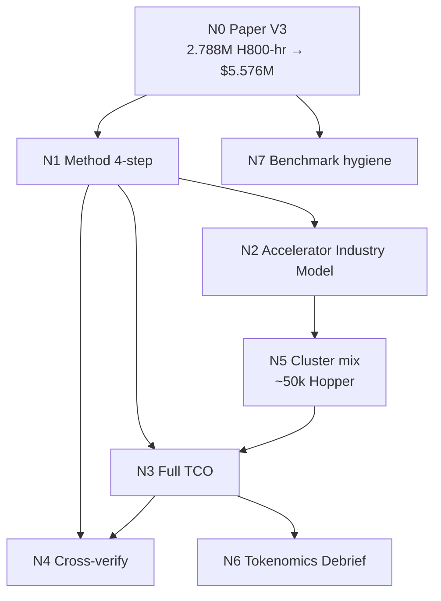

# SemiAnalysis × DeepSeek — memory network (hub)

**Purpose:** Agent-queryable map of Dylan Patel / SemiAnalysis cost & tokenomics analysis for DeepSeek.  
**Do not invent numbers.** Cite node IDs + source URLs. Prefer the **Numbers ledger** for exact figures.

## Query aliases → start here

| Visitor asks… | Retrieve first |
|---------------|----------------|
| “DeepSeek only cost $6M?” / training cost myth | `semianalysis-deepseek-cost` + `semianalysis-deepseek-numbers` |
| How did SemiAnalysis calculate it? / method / 4 steps | `semianalysis-method-4step` |
| Exact GPU hours / CapEx / 50k GPUs | `semianalysis-deepseek-numbers` |
| Which Semi reports? / sources | `semianalysis-report-index` |
| Inference price / tokenomics / latency tradeoff | `semianalysis-deepseek-tokenomics` |
| Hardware / HBM / Memory Wall | `hardware-memory-wall` |
| Huawei / Ascend Day-0 | site articles `huawei-hbm`, `huawei-supply` via searchArticles |

## Network graph

## Node → file map

| Node | File | Role |
|------|------|------|
| Hub | `semianalysis-memory-network.md` | this index |
| Claim | `semianalysis-deepseek-cost.md` | one-line claim + agent stance |
| Numbers | `semianalysis-deepseek-numbers.md` | **canonical figures** (formats locked) |
| Method | `semianalysis-method-4step.md` | paper → AIM → TCO → cross-check |
| Reports | `semianalysis-report-index.md` | Semi + paper + third-party URLs |
| Tokenomics | `semianalysis-deepseek-tokenomics.md` | post-R1 serving economics |
| Draft | `../drafts/deepseek-cost-myth.md` | unpublished article (not in TF-IDF) |

## Number format rules (for agents)

1. **Paper total:** always `$5.576M` (not “about six million” alone). Media round `~$6M` OK *after* citing exact.
2. **GPU hours:** use `2.788M` (= `2788K`) total; stage table must sum correctly.
3. **Assumptions:** `$2 / H800 GPU-hr` is a **rental assumption in the paper**, not a market quote Semi measured.
4. **Semi estimates:** prefix `~` or `>` — CapEx `~$1.6B`, OpEx `~$944M`, GPU spend `>$500M`, cluster `~50,000`.
5. **Never** write “50,000 H100”. Write **“~50,000 Hopper (H800 / H100 / H20 mix)”**.
6. **SKU split (Semi belief):** `~10,000 H800` + `~10,000 H100` + additional **H20** (orders / China-available SKU).
7. **Paper train cluster:** `2,048 H800` for the official V3 run (≠ full fleet).
8. Separate **final-run rental proxy** from **company CapEx/OpEx**.

## Core insight (shared)

`$5.576M` = **narrow efficiency metric** (final assembly line item).  
Real AI build cost = **experimentation + infrastructure + shared fleet TCO**.
