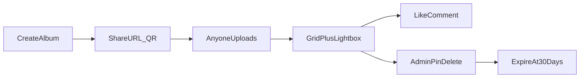
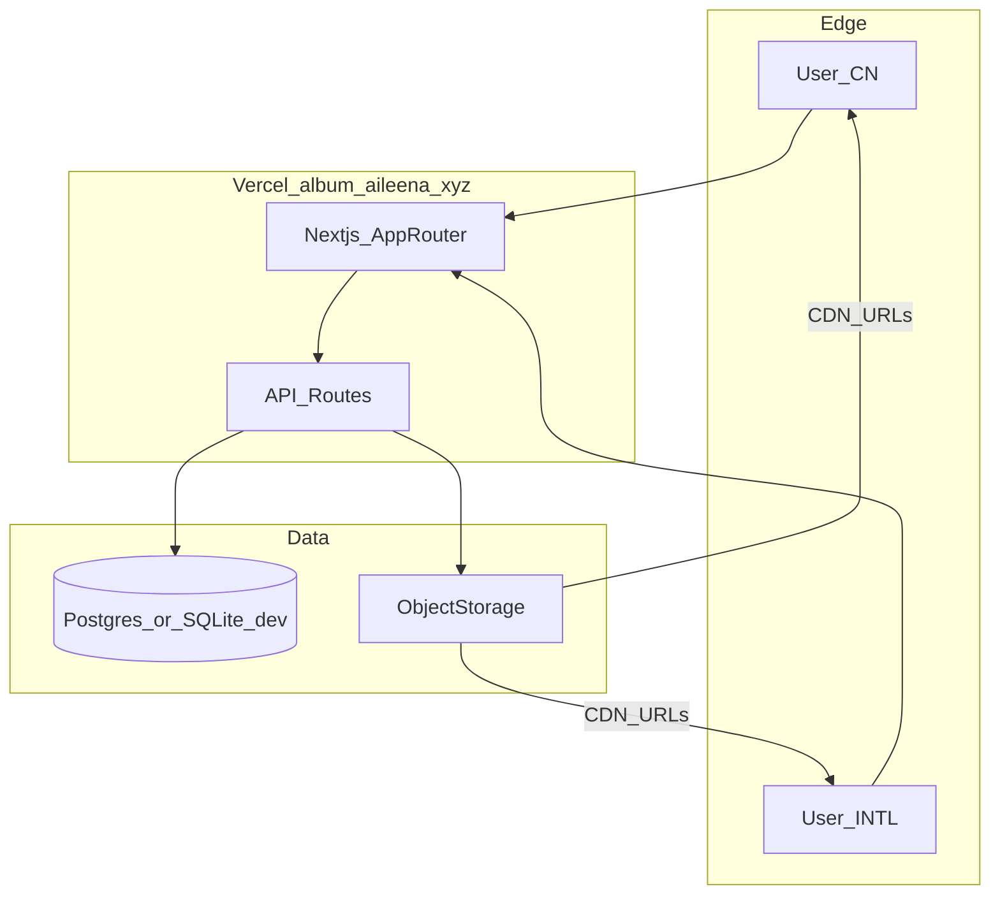

# Gather（共影）— Shared Event Album

**Domain:** `album.aileena.xyz`  
**Owner brand:** aileena.xyz  
**Reference:** pic-tomo.com (no-registration shared albums)

---

## 1. Product one-liner / 一句话

创建一个 **免注册、链接即入、人人可传** 的活动共享相册：约 **500 张 / 30 天**，支持点赞、评论、置顶、多选删除；挂在 `album.aileena.xyz`，国内外都能打开且访问要快。

Create a **no-signup, link-join, anyone-uploads** event album: **~500 photos / 30 days**, with likes, comments, pin, multi-delete — hosted at `album.aileena.xyz` with fast access in CN and abroad.

---

## 2. Who it’s for / 场景

| Scene | Why Gather |
|-------|------------|
| Wedding / party / trip | Guests scan QR, dump phone photos |
| Cafe Cursor / IRL events | Same-day collective memory |
| Family reunion | Elders don’t need App Store |

**Anti-goals (MVP):** permanent cloud library, social network, AI face grouping, native apps.

---

## 3. Core loop / 核心闭环

1. Host enters album title → gets **public URL + QR + admin secret** (shown once).
2. Guests open link (no account) → nickname optional → upload photos.
3. Live masonry/grid; pinned photos float to the **front**.
4. Anyone can like / comment; **admin** can pin, multi-select delete, close uploads.
5. After **30 days** album is soft-expired (read-only then purge job).

---

## 4. Feature map / 功能图

### MVP (this repo)

| Feature | Spec |
|---------|------|
| Create album | Title + optional cover mood; no signup |
| Capacity | **500 photos / album** |
| TTL | **30 days** from `createdAt` |
| Share | Short URL `/a/[slug]` + QR |
| Upload | Multi-file, phone camera + gallery; HEIC→JPEG best-effort |
| Gallery | Responsive grid; pinned first |
| Lightbox | Swipe / keyboard; like + comment thread |
| Like | Per-device fingerprint cookie (no account) |
| Comment | Nickname + text (max 280) |
| Pin | Admin toggles; pinned sort to start |
| Multi-delete | Admin select mode → delete |
| Admin | Cookie after entering secret on create or `/admin` unlock |
| Expire | API rejects uploads after TTL; cron/docs for purge |

### Phase 2 (explicitly out of MVP)

- Paid extend (photos / days) like PicTomo tiers  
- ZIP bulk download / print sheet  
- Album password (view-only guests)  
- Dual-CDN China origin (阿里云 OSS + 海外 R2) + geo DNS  
- Real-time websocket refresh  
- Share-reward capacity boost  
- Host dashboard across many albums  

---

## 5. Trust & roles / 权限

| Role | How | Can |
|------|-----|-----|
| Guest | Link only | Upload, like, comment, view |
| Admin | `adminSecret` cookie | Pin, multi-delete, toggle upload lock, rename |

No global accounts in MVP. Admin secret is **not** recoverable if lost (shown once + copy).

---

## 6. Architecture / 架构

| Layer | MVP choice | Why |
|-------|------------|-----|
| App | Next.js 14 App Router (sibling to `cafe-cursor`) | Matches monorepo deploy |
| Host | Vercel project root = `album/` → `album.aileena.xyz` | Same DNS pattern as cafe |
| DB | Prisma; **SQLite local**, **Postgres prod** | Cafe-cursor pattern; zero-friction verify |
| Files | Storage adapter: `local` \| `vercel-blob` \| `r2` | Swap without rewriting UI |
| CDN | Blob/R2 public URLs (+ later dual OSS) | Fast intl now; CN Phase 2 |
| Auth | HMAC-ish admin cookie per album | No account system |

### CN + intl speed strategy

1. **MVP:** serve UI from Vercel; images from Blob/R2 with long-cache + WebP/JPEG thumbs (≤1600px long edge).  
2. **Phase 2:** write originals to **R2 (intl) + 阿里云 OSS (CN)**; Cloudflare / DNSPod geo or path-based image host selection; optional China ICP if required for marketing domain.  
3. Always serve **thumbnails first**; originals on lightbox demand.

---

## 7. Data model / 数据模型

- `Album`: id, slug, title, adminSecretHash, expiresAt, uploadLocked, photoCount, createdAt  
- `Photo`: id, albumId, key, thumbKey, width, height, uploaderName, pinned, pinnedAt, likeCount, createdAt  
- `Like`: id, photoId, visitorKey (unique pair)  
- `Comment`: id, photoId, authorName, body, createdAt  

Soft-delete photos; hard-delete storage on purge.

---

## 8. URL map / 路由

| Path | Purpose |
|------|---------|
| `/` | Create landing (brand hero) |
| `/a/[slug]` | Album wall |
| `/a/[slug]/admin` | Unlock admin |
| `/api/...` | REST for albums/photos/likes/comments |

---

## 9. Limits & abuse / 限额

- Max **20 files / request**, **15 MB / file**, **500 / album**  
- Comment rate: soft limit per visitorKey  
- Expired albums: uploads 410; view until purge window (7 days) optional  

---

## 10. Brand / UI notes

- Product name **Gather** with Chinese **共影** as secondary mark  
- First viewport: brand + one line + one CTA (create) — not a dashboard  
- Atmosphere: soft paper gradient + real photo collage plane (not flat white)  
- Fonts: expressive display + clean body (not Inter/Roboto/system-only)  
- Motions: hero fade/rise, grid stagger, pin spring  

---

## 11. Deploy checklist

1. New Vercel project, Root Directory = `album`  
2. Env: `DATABASE_URL`, `ADMIN_COOKIE_SECRET`, optional `BLOB_READ_WRITE_TOKEN` / R2 keys  
3. DNSPod CNAME `album` → `cname.vercel-dns.com`  
4. Link from aileena.xyz footer / works when ready  

---

## 12. Success metrics (soft)

- Time-to-first-upload &lt; 60s after create  
- Guest upload success rate on mobile Safari / WeChat in-app browser  
- p95 thumb load &lt; 1.5s on decent CN/intl mobile networks (Phase 2 CDN)  
