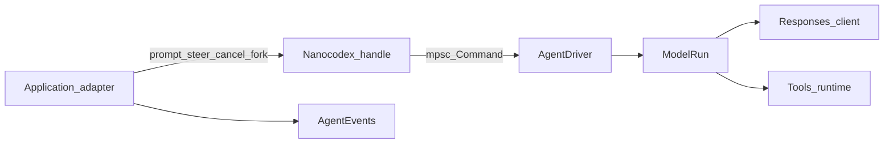
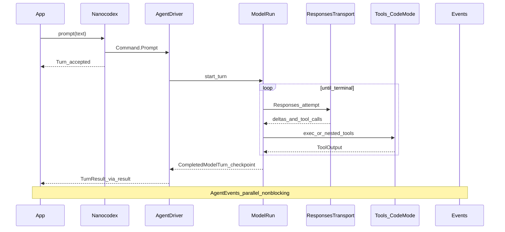
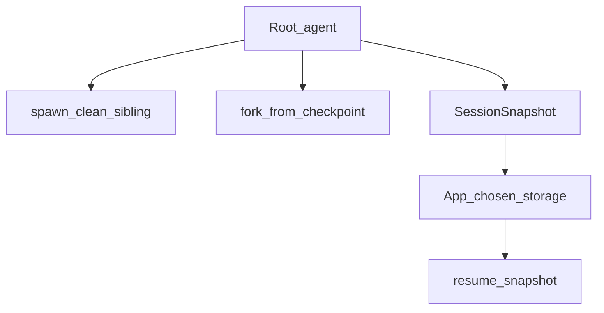
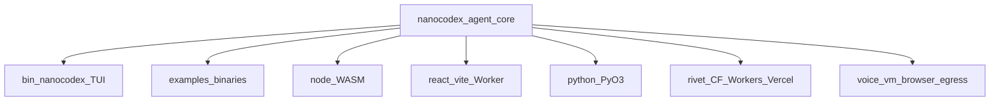

# Nanocodex architecture（老师 harness 系统图）

> 对照上游 [gakonst/nanocodex](https://github.com/gakonst/nanocodex)（≈ v0.3）。  
> 本文讲 **系统长什么样**；源码指针见 [NANOCODEX_SOURCE_MAP.md](./NANOCODEX_SOURCE_MAP.md)。  
> 本地教学镜像是本目录的 `hx` — 不是上游运行时。

---

## 1. Thesis（三句话）

1. **小积木**：OpenAI client 可无 agent；tools 可无 CLI；agent 只组合，不另藏一套实现。
2. **模型与 harness 共设计**：compaction、cache identity、tool shapes、cancel、reconnect replay 是模型面契约，不是产品 UI。
3. **证据优先**：bench / OTel / differential / eval 保证 turn 主要吃模型和网络延迟。

---

## 2. 分层（library-first）

```text
Adapters
  bin/nanocodex (TUI/CLI)
  examples/*  ·  node/  ·  python/  ·  react-vite/  ·  browser-cdn/
  rivet-actors/  ·  cloudflare-workers/  ·  vercel-workflows/
        │
        ▼
Facade     nanocodex                 Alloy-style reexports / prelude
        │
        ▼
Agent      nanocodex-agent           owned driver · Turn · spawn/fork/resume
        ├── oai      nanocodex-oai-api     Responses · auth · Tower · pricing
        └── tools    nanocodex-tools       registry · Code Mode · MCP · workspace
              └── macros  nanocodex-tools-macros
        │
Optional   nanocodex-observability
Experimental  voice · vm · browser · egress · eval
```

| Layer | Crate | 职责 |
|-------|-------|------|
| Facade | `nanocodex` | 根路径黄金 API；细 API 挂在 `::agent` / `::oai` / `::tools` |
| Agent | `nanocodex-agent` | 私有 driver、prompt 排序、tool loop、AGENTS.md、compaction 时机、snapshot、分支 |
| OAI | `nanocodex-oai-api` | API-key / ChatGPT auth、typed Responses、WS transport、continuation/replay、Tower client |
| Tools | `nanocodex-tools` | `Tool` 契约、`#[tool]`、Code Mode、workspace tools、MCP |
| Obs | `nanocodex-observability` | 可选 tracing |
| Exp | `nanocodex-{voice,vm,browser,egress,eval}` | 合同仍在成熟中的能力 |

**边界不变量：** 上层可缺席。`OpenAi → Session → ResponseTurn` 可单独用；`Tools` 可无 agent。

---

## 3. Ownership（谁拥有可变状态）



| 所有者 | 拥有 | 不拥有 |
|--------|------|--------|
| Adapter（TUI / Worker / CLI） | UX、存储策略、密钥注入、何时 snapshot | 对话 history 细节 |
| `Nanocodex` handle（可 clone） | 发 `Command` 的能力 | 可变 session 本体 |
| `AgentDriver` | history、transport、tools、process、排队、compact | 产品 UI |
| `Tools` / Code Mode | 工具执行、JS cell、shell 会话 | 模型消息拼装 |
| Application policy | 保留多久、落哪盘 | driver 内循环 |

Caller **从不**把 previous messages / response IDs / tool results 再塞回 agent — driver 自己留着。

---

## 4. 一次 Turn 时序



### 公开语义

| API | 含义 |
|-----|------|
| `prompt(...).await` | driver **接单并排序**（第一次 await） |
| `turn.result().await` / 二次 await | 等 **本 turn 完成** |
| `AgentEvents` | 会话级 firehose；与 result **解耦** |
| `steer` | 在下一个 **safe model boundary** 原子切入（voice / realtime 同款） |
| `cancel` | 取消排队或进行中的 turn；不 commit 半截 history |

### Commit 规则

- 只把 **完成** 的 turn 写进 history / fork checkpoint  
- cancel、基础设施失败、半截 tool 结果 → **不进** committed history  
- `fork` / `fork_from` 只从已 commit 的 safe boundary 取样  

---

## 5. 分支与持久化



| 操作 | 行为 |
|------|------|
| `spawn()` | 新 session / 新 cache lineage / **不**继承 history；复用 builder 私有配置与 tools factory |
| `fork()` / `fork_from(checkpoint)` | 从已 commit 边界分出独立分支 |
| `snapshot()` → bytes | 应用自选存储与保留策略 |
| `resume(snapshot)` | 新 driver 从 checkpoint 续跑 |
| `rollout/`（可选） | Codex-compatible 落盘身份与路径 |

`AgentHandle`（弱引用）给 `tools_factory`：子 agent 工具可 `spawn` / `fork` 而不把 parent 钉死。

---

## 6. Tools / Code Mode 架构

### 曝光策略

- 默认 **`ToolExposure::CodeModeOnly`**：模型主要看见 Code Mode 入口（`exec`）；普通 tool 经细胞内 `tools.*` 调用  
- `DirectAndCodeMode`：同一批 tool 既可直接也可经 `exec`（Codex 兼容形状）  
- 曝光改的是 **模型可见面**，不是注册/分发实现  

### Code Mode

- 嵌入 **QuickJS** cell（预热 host；失败则首次 cell 重试）  
- 一细胞内可 `if` / 循环 / `Promise.all` 组合多个 tool — **中间不回模型**  
- nested tool fanout 有并发上限；支持 yield / wait / observer 协议  
- 不是 Node `AsyncFunction` 玩具沙箱；也不是「安全边界」口号替代 VM  

### Workspace 可拆 guest

`workspace-runtime` 特征：保留 `exec_command` / `write_stdin` / `apply_patch` / `view_image` 给 VM guest companion。  
**故意不含** agent registry、Code Mode、MCP、macros、OpenAI transport。

### MCP

- Streamable HTTP（及 stdio 等）客户端  
- deferred `tool_search`：先搜再调，避免一次塞满 catalog  

---

## 7. 部署拓扑（同一核心，多种宿主）



| Surface | 角色 |
|---------|------|
| `bin/nanocodex` | 生产 TUI / CLI；`nanocodex auth login` 共享 `~/.codex/auth.json` |
| `examples/*` | 库边界 smoke（minimal → subagents → secret-egress） |
| `js/bindings` + `examples/node` / `react-vite` / `browser-cdn` | WASM agent；浏览器要宿主提供已授权 WS URL |
| `py/bindings` | PyO3：follow_on / events / lifecycle |
| Rivet / Cloudflare DO / Vercel Workflows | durable actor + sandbox + 休眠恢复 |
| `nanocodex-vm` + `nanocodex-egress` | 隔离 guest 工具 + 密钥经 host proxy，不进模型 |

---

## 8. 与本地三套系统对照

| 系统 | 架构一句话 |
|------|------------|
| **Nanocodex** | library-first：Driver 独占 + Code Mode 与 Responses 共设计 |
| **`harness-cli` / `hx`** | TS 教学镜像：单进程 `Harness` loop + 简化 Code Mode（`AsyncFunction`） |
| **`aileena-new` `/api/chat`** | 产品 ReAct：Vercel AI SDK + `toolRouter` / `reactGuard`；**未**接 nanocodex |

`hx` 的 A/B 命名（`Codex` / `Nanocodex`）是 **产品标签**，不是上游 crate 绑定。见 `src/core/abAssign.ts`。

---

## 9. 读下一篇

- 源码地图 / examples 阶梯 / `hx` 差距表 → [NANOCODEX_SOURCE_MAP.md](./NANOCODEX_SOURCE_MAP.md)  
- 手写步骤 → [HANDWRITTEN_HARNESS.md](./HANDWRITTEN_HARNESS.md)  
- `hx` 设计 thesis → [DESIGN.md](./DESIGN.md)  
- 上游 → https://github.com/gakonst/nanocodex  
